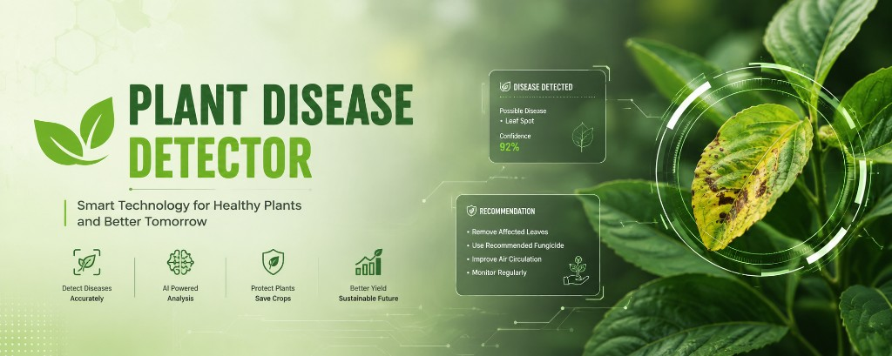
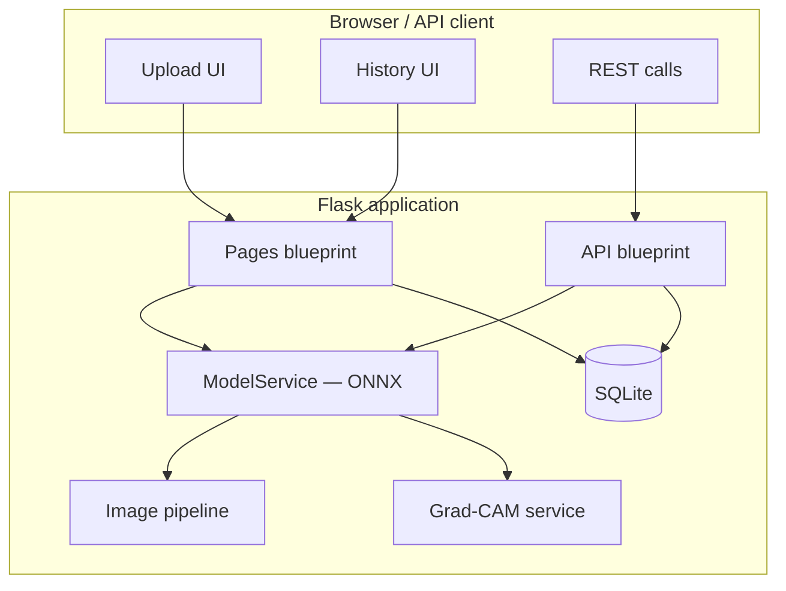
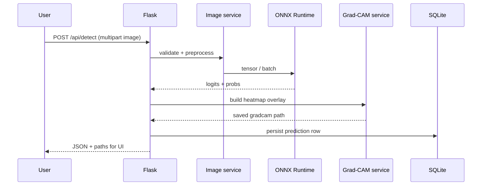
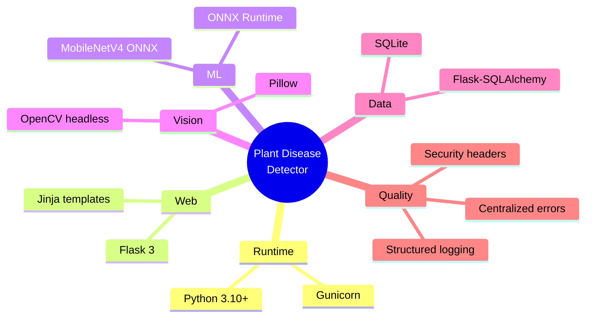

<div align="center">



### Smart tomato leaf diagnostics in the browser

**Upload a leaf photo → ONNX inference → confidence, top predictions, treatment hints, and an explainability heatmap — all saved to SQLite history.**

<br/>

[](https://www.python.org/)
[](https://flask.palletsprojects.com/)
[](https://onnxruntime.ai/)
[](https://opencv.org/)
[](https://www.sqlite.org/)

<br/>

[](https://render.com/)
[](https://railway.app/)

</div>

---

## Table of contents

| | |
|:---:|:---|
| **1** | [Why this project](#why-this-project) |
| **2** | [Feature tour](#feature-tour) |
| **3** | [Architecture at a glance](#architecture-at-a-glance) |
| **4** | [How a request flows](#how-a-request-flows) |
| **5** | [Tech stack](#tech-stack) |
| **6** | [Folder structure](#folder-structure) |
| **7** | [Local setup](#local-setup) |
| **8** | [Environment variables](#environment-variables) |
| **9** | [API reference](#api-reference) |
| **10** | [Database schema](#database-schema) |
| **11** | [Deployment](#deployment) |
| **12** | [Production checklist](#production-checklist) |
| **13** | [Grad-CAM note](#grad-cam-note) |

---

## Why this project

This repository is a **production-minded, beginner-friendly** Flask application that turns a trained **MobileNetV4** classifier (exported to **ONNX**) into a full web experience: validated uploads, consistent preprocessing, JSON APIs, HTML pages, optional API-key protection, and **Grad-CAM–style** overlays so predictions are not just a label — they come with **visual context** and **actionable treatment text** where available.

---

## Feature tour

| Area | What you get |
|------|----------------|
| **Inference** | ONNX Runtime loads **once** at startup; fast CPU-friendly predictions. |
| **Preprocessing** | OpenCV + Pillow: CLAHE, bilateral filtering, HSV leaf segmentation, resize, normalization (`imagenet` or `0..1`). |
| **Results** | Primary label, **confidence**, **severity**, **top-3** alternatives, treatment and solution strings. |
| **Explainability** | Heatmaps saved under `static/gradcam` (occlusion-style method compatible with standard ONNX classifiers). |
| **History** | SQLite + SQLAlchemy — browse the latest predictions from the UI or API. |
| **Frontend** | Responsive **HTML / CSS / vanilla JS** — no heavy SPA build step. |
| **Ops** | `Procfile`, `runtime.txt`, and **Gunicorn**-ready commands for **Render** and **Railway**. |

---

## Architecture at a glance



---

## How a request flows



---

## Tech stack



---

## Folder structure

<details>
<summary><strong>Expand full tree</strong> — same layout as the repo on disk</summary>

```text
plant-disease-detector/
├── app.py                  # Application factory + model warmup
├── config.py               # Environment-driven settings
├── requirements.txt
├── Procfile                # Gunicorn for PaaS
├── runtime.txt             # Python version pin for hosts
├── .env                    # Local secrets (never commit)
├── .env.example            # Safe template for production
├── assets/
│   ├── project-banner.png    # README hero (your brand banner)
│   └── readme-banner.svg     # Optional compact animated header
├── ai_model/
│   ├── model.onnx          # Your exported classifier
│   ├── model.onnx.data     # Optional external weights
│   ├── metadata.json
│   └── labels.txt
├── database/
│   ├── extensions.py
│   ├── init_db.py
│   └── plant_disease.db    # Created at runtime (gitignored)
├── models/
│   └── prediction.py       # History table
├── routes/
│   ├── api.py              # JSON endpoints
│   └── pages.py            # HTML routes
├── services/
│   ├── disease_service.py  # Metadata + treatment copy
│   ├── gradcam_service.py
│   ├── image_service.py
│   ├── model_service.py
│   └── storage_service.py
├── utils/
│   ├── error_handlers.py
│   ├── errors.py
│   ├── logging_config.py
│   ├── security.py
│   └── validators.py
├── static/
│   ├── css/styles.css
│   ├── js/app.js | result.js | history.js
│   ├── uploads/
│   └── gradcam/
├── templates/
│   ├── base.html
│   ├── index.html
│   ├── result.html
│   ├── history.html
│   └── error.html
├── scripts/
│   └── export_checkpoint_to_onnx.py
├── outputs_mobilenetv4_android_final/   # Optional: PyTorch checkpoint
└── tomato-leaf.ipynb
```

</details>

---

## Local setup

<details>
<summary><strong>Step 1 — Virtual environment</strong></summary>

**macOS / Linux**

```bash
python3 -m venv venv
source venv/bin/activate
```

**Windows (cmd)**

```bat
python -m venv venv
venv\Scripts\activate.bat
```

**Windows (PowerShell)**

```powershell
python -m venv venv
.\venv\Scripts\Activate.ps1
```

</details>

<details>
<summary><strong>Step 2 — Install dependencies</strong></summary>

```bash
pip install -r requirements.txt
```

</details>

<details>
<summary><strong>Step 3 — Model files</strong></summary>

Place your trained ONNX export at:

```text
ai_model/model.onnx
```

If your export split weights into a sidecar file, keep **`model.onnx.data`** next to `model.onnx` — ONNX Runtime expects both.

**From Kaggle (example path from training):**

```text
/kaggle/working/outputs_mobilenetv4_android_final/android_export/mobilenetv4_conv_medium.onnx
```

Download, move into `ai_model/`, and rename to `model.onnx` if needed.

**From PyTorch checkpoint instead**

Put `best.pt` under:

```text
outputs_mobilenetv4_android_final/best.pt
```

Then:

```bash
pip install torch timm onnx
python scripts/export_checkpoint_to_onnx.py
```

</details>

<details>
<summary><strong>Step 4 — Environment & run</strong></summary>

Copy `.env.example` to `.env` and adjust values (see [Environment variables](#environment-variables)).

```bash
python app.py
```

Open **[http://127.0.0.1:5000](http://127.0.0.1:5000)**.

</details>

---

## Environment variables

| Variable | Role |
|----------|------|
| `FLASK_ENV` | `development` vs `production` behaviour. |
| `FLASK_DEBUG` | Toggle Flask debug (keep `0` in production). |
| `SECRET_KEY` | Session / signing secret — use a long random string in production. |
| `MODEL_PATH` | Path to ONNX model (default `ai_model/model.onnx`). |
| `MAX_UPLOAD_MB` | Upper bound for uploaded images. |
| `IMAGE_SIZE` | Square input size (e.g. `224`). |
| `NORMALIZATION_MODE` | `imagenet` or `zero_one` — **must match training**. |
| `REQUIRE_API_KEY` | Set to `1` to require `X-API-Key` on APIs. |
| `API_KEY` | Shared secret when API key mode is enabled. |
| `GRADCAM_GRID_SIZE` | Grid density for occlusion-style maps. |

---

## API reference

### `POST /api/detect`

Multipart form field: **`image`** (leaf photo).

**Example response**

```json
{
  "success": true,
  "disease": "Late Blight",
  "confidence": 97.52,
  "severity": "High",
  "top_predictions": [],
  "gradcam_image": "gradcam/session_gradcam.jpg",
  "treatment": "Urgent fungicide",
  "solution": "Remove badly infected plants..."
}
```

| Method | Path | Purpose |
|--------|------|---------|
| `GET` | `/api/result/<session_id>` | Fetch one saved prediction. |
| `GET` | `/api/history` | Latest **50** predictions. |
| `GET` | `/api/health` | Model + database readiness probe. |

---

## Database schema

SQLite file (created automatically):

```text
database/plant_disease.db
```

**Columns stored per prediction**

`id` · `session_id` · `image_path` · `disease_name` · `confidence_score` · `severity` · `treatment` · `solution` · `top_predictions` · `gradcam_path` · `prediction_time` · `created_at`

---

## Deployment

<details>
<summary><strong>Render</strong></summary>

1. Push this repository to GitHub.
2. Create a **Web Service** on Render.
3. **Build:** `pip install -r requirements.txt`
4. **Start:** `gunicorn app:app --bind 0.0.0.0:$PORT --workers 1 --threads 4 --timeout 120`
5. Add environment variables from `.env.example`.
6. Ensure `ai_model/model.onnx` is available in the deployment (repo artifact or secure upload).

</details>

<details>
<summary><strong>Railway</strong></summary>

1. New project from the GitHub repository.
2. Railway picks up the **`Procfile`**.
3. Set environment variables from `.env.example`.
4. Confirm the ONNX bundle is present in the deployed filesystem.
5. Deploy and use the generated URL.

</details>

---

## Production checklist

- [ ] `FLASK_ENV=production` and `FLASK_DEBUG=0`
- [ ] Strong, unique `SECRET_KEY`
- [ ] `.env` never committed; use host env vars
- [ ] Optional: `REQUIRE_API_KEY=1` + rotate `API_KEY`
- [ ] Prefer **`opencv-python-headless`** on servers (already in `requirements.txt`)
- [ ] **One Gunicorn worker** keeps a single in-process ONNX model — predictable RAM

---

## Grad-CAM note

Plain ONNX Runtime does **not** expose training-time gradients for most exported classifiers. This app uses a **fast occlusion-based, Grad-CAM–style** visual that works with standard ONNX classification heads. If you export intermediate feature maps or keep a PyTorch graph with gradients, you can replace `services/gradcam_service.py` with true gradient Grad-CAM.

---

<div align="center">

**Built for learners and shippers alike — ship a model, ship a product.**

<br/>

<sub>Hero image: <code>assets/project-banner.png</code>. Optional animated strip: <code>assets/readme-banner.svg</code>.</sub>

</div>
